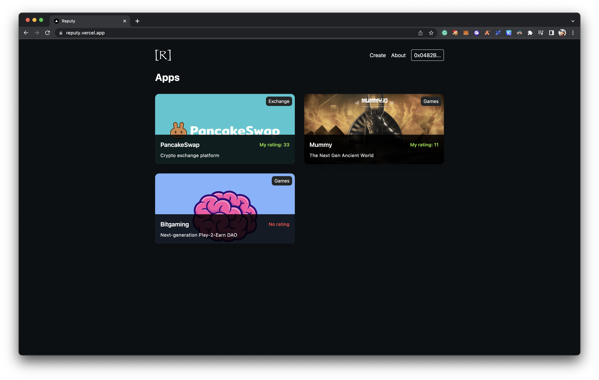

<p align="center">
  <a href="http://reputy.vercel.app">
    
  </a>
</p>

<h1 align="center">Reputy</h1>

<p align="center">Web3 reputation framework to integrate with your own DApp</p>



### Idea

Unified framework that deploys rating system smart contract for your own decentralized application.

### Flexible

Integrate our solution and change rating of users based on the actions they perform in your application.

### Rarity

Our smart contract generates on-chain NFT for users with 5 different levels of rarity.

## Smart contracts

Our core smart contract is verified on Goerli testnet.

| Contract                                  | Link                                  |
| ---------------------------------------- | -------------------------------------------- |
| `ReputyRegistry` | [0x5C799D1c1E23476847010a632AA68bcF6AFe4BA5](https://goerli.etherscan.io/address/0x5C799D1c1E23476847010a632AA68bcF6AFe4BA5#code) |
## Setup

### Install

```bash
git clone https://github.com/ironsoul0/Reputy
cd Reputy
forge install
```

### Run

Run tests with Foundry.

```bash
forge test
```

Deploy to your local blockchain node.

```bash
forge script script/Reputy.s.sol:ReputyScript --broadcast --rpc-url $ETH_RPC_URL --private-key $PRIVATE_KEY --verify
```

## Notes

- This project was created for participating in [AITU BNB Hackathon](https://www.aitubnbchainhackathon.xyz/tasks)
- Developed by [@Akezh](https://github.com/Akezh) and [@ironsoul0](https://github.com/ironsoul0)

## License

This project is open source and available under the [MIT License](LICENSE).